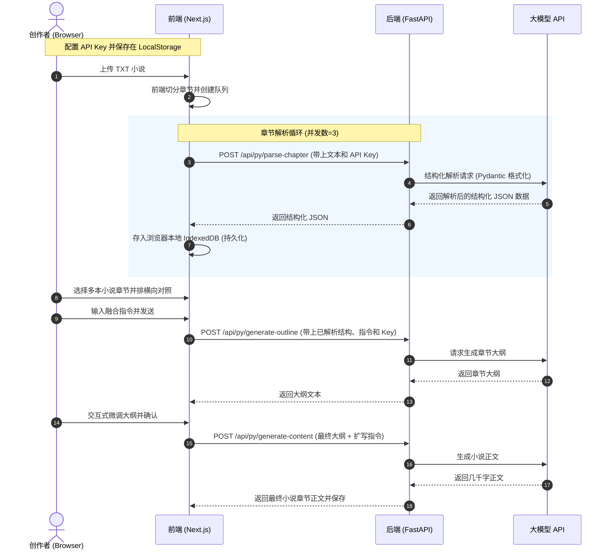

# yaml-write 项目技术栈与开发规划

本文档（`agent.md`）用于确立当前项目的核心技术栈、文件结构以及后续的开发与部署规范，方便 AI 助手与开发者保持高度同步。

---

## 1. 核心技术栈 (Technology Stack)

当前项目基于 Vercel 推荐的 **Next.js (Frontend) + FastAPI (Backend)** 混合 Monorepo 模板构建，技术栈参数如下：

### 🔹 前端 (Frontend)
*   **核心框架**：`Next.js 14.2.13` (采用最新的 App Router 路由模式)
*   **开发语言**：`TypeScript 5.6.2`
*   **视图层**：`React 18.3.1` 和 `React-DOM 18.3.1`
*   **样式方案**：`Tailwind CSS 3.4.12` + `PostCSS 8.4.47`（支持响应式布局、深色模式和现代 UI 样式）
*   **进程并发**：`concurrently 9.0.1`（用于一键同时启动前后端开发服务器）
*   **【新增】状态管理 (State Management)**：`Zustand` (当前 React 界最推崇的轻量、高性能状态机，用于跨组件管理全局配置如 API Keys、当前选中的小说/章节、UI 面板状态等，完美替代繁琐的 Context API)。
*   **【新增】本地数据库 (IndexedDB Wrapper)**：`Dexie.js` + `dexie-react-hooks` (公认最优雅的 IndexedDB 包装库，提供类 SQL/ORM 语法，完美支持 React 响应式 Hooks，大容量保存解析完的小说章节，避免刷新丢失)。
*   **【新增】现代图标库 (Icons)**：`lucide-react` (简洁、高颜值的 React 现代化矢量图标库，提供极致精致的视觉效果)。

### 🔹 后端 (Backend)
*   **核心框架**：`FastAPI 0.115.0` (高性能、易用且支持自动生成 OpenAPI/Swagger 交互式文档的 Python 框架)
*   **ASGI 服务器**：`Uvicorn 0.30.6` (高并发的 Python Web 服务器)
*   **开发语言**：`Python 3.x`
*   **路由前缀**：所有 Python 后端接口统一在 `/api/py/` 前缀下对外暴露。
*   **【新增】数据建模与校验 (Data Validation)**：`Pydantic v2` (FastAPI 内置，用于严格校验前端传入的参数，并严格定义大模型返回的数据结构，确保系统绝对健壮)。
*   **【新增】大模型 SDK (LLM SDK)**：`openai` 官方 Python SDK (作为底层统一接口，用来以标准格式调用所有 OpenAI 协议兼容的大模型服务，包括 Gemini、DeepSeek、Qwen、OpenAI 等)。
*   **【新增】结构化数据提取 (Structured JSON Extraction)**：`instructor` (目前 AI 圈公认的**最佳实践工具**。它基于 Pydantic 对大模型进行包装，利用 JSON Mode / Tool Calls 强制要求大模型返回我们定义的 Python class 结构，100% 解决大模型提取 JSON 时格式不稳定的痛点！)。
*   **【新增】长文本流式传输 (Streaming / SSE)**：使用 FastAPI 配合大模型 SDK 实现 **Server-Sent Events (SSE) 流式传输**，在进行大纲扩写正文时字一个个蹦出来，既能规避 Vercel Serverless 的 10 秒超时限制限制，又能提供极佳的用户体验。

### 🔹 部署与云服务 (Deployment & Infrastructure)
*   **部署托管平台**：**Vercel**
*   **CI/CD 自动化**：与 GitHub 深度集成。任何提交推送到 GitHub 的 `main` 分支后，Vercel 会自动拉取代码、并行打包前端和 Python 后端，并零停机上线。
*   **网络通信与代理**：
    *   在本地和线上，前端通过 `next.config.js` 的 `rewrites` 规则，将路径为 `/api/py/:path*` 的请求自动转发至底层的 FastAPI 服务。
    *   同源域名访问，无任何 **CORS (跨域)** 问题。

---

## 2. 项目目录结构 (Project Directory Structure)

```text
yaml-write/
├── app/                  # 【前端】Next.js 页面与路由
│   ├── api/              # Next.js 原生 API 路由 (如 Node.js 写的 helloNextJs)
│   ├── globals.css       # 全局样式文件 (Tailwind 引入)
│   ├── layout.tsx        # 全局公共布局模板
│   └── page.tsx          # 前端主页入口 (对应 http://localhost:3000/)
├── api/                  # 【后端】FastAPI 项目核心目录
│   └── index.py          # FastAPI 服务入口文件 (定义路由与业务逻辑)
├── public/               # 静态资源存放目录 (图片、图标等)
├── package.json          # Node.js 项目配置文件及依赖声明
├── requirements.txt      # Python 项目依赖声明
├── next.config.js        # Next.js 核心配置文件 (配置了转发 Python API 的 rewrites)
├── tailwind.config.js    # Tailwind 样式定制配置文件
└── agent.md              # 【本文档】项目技术栈与 AI 开发规范
```

---

## 3. 本地开发与调试指令 (Local Development)

在本地机器上运行本项目前，请确保已安装 **Node.js** 和 **Python 3** 环境，随后在项目根目录运行以下命令：

### 1️⃣ 安装所有依赖
```bash
# 安装前端相关依赖
npm install

# 安装后端相关依赖
pip install -r requirements.txt
```

### 2️⃣ 启动开发服务器
```bash
npm run dev
```
> **💡 原理说明**：该命令会同时启动 Next.js（端口 3000）和 Uvicorn（端口 8000）。
> *   访问 **前端页面**：`http://localhost:3000`
> *   访问 **Python 接口**：`http://localhost:3000/api/py/helloFastApi`
> *   访问 **交互式 API 文档 (Swagger)**：`http://localhost:3000/api/py/docs`

---

## 4. 业务功能规划：小说创意融合与写作助手

根据与开发者的互动对齐，本项目将转型并构建为一个**隐私安全、零成本托管、体验极佳的“多小说创意融合与智能协作写作工具”**。

### 📌 核心功能模块设计

#### 1️⃣ 大模型接入与配置 (BYOK - Bring Your Own Key)
*   **交互逻辑**：前端提供设置面板，用户输入自定义的 API Key 和 Base URL。
*   **兼容协议**：完全兼容 OpenAI 格式接口（支持 Gemini、OpenAI、Anthropic、DeepSeek、GLM、Qwen 等主流模型）。
*   **数据存储**：**100% 存储于用户本地浏览器（LocalStorage）**，绝不经过服务器中转或持久化，确保隐私与 Key 的绝对安全。

#### 2️⃣ 小说上传与分章解析 (Novel Upload & In-Memory Parsing)
*   **文件格式**：首期仅支持 **`.txt`** 格式小说。
*   **上传机制**：文件上传后**不保存到云端**，直接在浏览器端或后端内存中进行临时读取。
*   **分章规则**：通过正则匹配（如 `第[一二三四五六七八九十百千\d]+章` 或空行行首）自动切分章节，展示为章节列表。
*   **解析队列控制**：
    *   用户在界面看到章节列表，可点击“解析该章”或“一键解析全部”。
    *   前端控制**最大并发数（如每次最多并发 3 章）**调用 FastAPI 接口，有效避免触发大模型 API 的频控（Rate Limit）。
    *   解析维度包含：*世界观背景、核心故事骨架、出场角色、人物关系网络、叙事风格*。
*   **数据持久化**：解析完成的结构化 JSON 数据存储在浏览器的 **IndexedDB** 中，即便刷新页面或重启浏览器，解析成果依然秒级加载，无需重复消耗 Token。

#### 3️⃣ 多维横向对比视图 (Side-by-Side Multi-View)
*   **对照看板**：支持双栏或多栏并排布局，用户可以选择“小说 A 的第一章”与“小说 B 的第一章”并列查看。
*   **对比字段**：直观横向对比世界观、角色设定、剧情冲突等解析字段，方便创作者寻找灵感。

#### 4️⃣ “大纲 ➡️ 正文”创意融合生成流
*   **第一步：大纲/骨架生成**
    *   用户选中多本小说的解析成果，输入融合构想（例如：“把小说 A 的废土科幻世界观，融入小说 B 的国风仙侠主角和冲突模式”）。
    *   AI 提取融合点，首先生成**“新小说章节大纲”**（包含故事线、起承转合、新人物动作）。
*   **第二步：大纲精细化调整**
    *   用户在富文本/输入框中，对 AI 生成的“大纲”进行人工微调和修改。
*   **第三步：正文扩写**
    *   确认大纲无误后，指令 AI 基于调整好的最终大纲进行扩写，产出高质量的**“小说详细正文”**。

---

## 5. 前后端数据流设计 (Data Flow Architecture)



---

## 6. 即将开始的开发迭代路径 (Milestones)

1.  **【Milestone 1】**：完成极简且炫酷的设置面板，支持保存大模型 API Key 至本地并提供连通性测试接口。
2.  **【Milestone 2】**：实现 `.txt` 文件的上传、分章解析算法，配置 FastAPI 的结构化数据分析接口（利用大模型返回结构化 JSON）。
3.  **【Milestone 3】**：实现浏览器本地 IndexedDB 存储（如使用 `localforage` 库），并搭建章节列表进度条控制组件。
4.  **【Milestone 4】**：开发双栏并排对比看板。
5.  **【Milestone 5】**：开发“大纲 ➡️ 正文”两步小说融合生成流，打通端到端写作体验。
